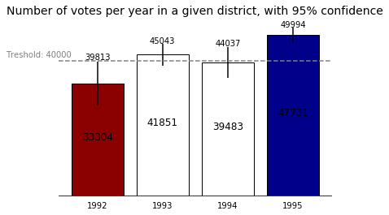

# Activity 3 - Custom Visualization

This activity consists in building a custom visualization for a set of random generated data. The idea is to make it visually insightfull using color information.

The visual that was created for this activity is displayed below. One relevant point to highlight: the colors of the bars ajust automatically based on the treshold that is selected. However, the treshold must be set inside the code using the `treshold` variable.

All code and information for this activity are contained in the Jupyter Notebook file (`ipynb` extension).