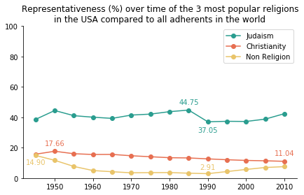

# Activity 4 - Becoming a Data Scientist - Religion Analysis

This activity consists in building a visualization that answears a research question regarding religion for the USA. The proposed research question is: **What is the representativeness (%) over time of the 3 most popular religions in the USA, compared to all adherents in the world?**

The visual that was created for this activity is displayed below. One relevant point to highlight: each line displays it's maximum and minimum value for the considered time series of data.

All code and information for this activity are contained in the Jupyter Notebook file (`ipynb` extension).